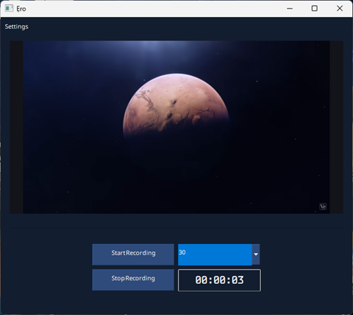
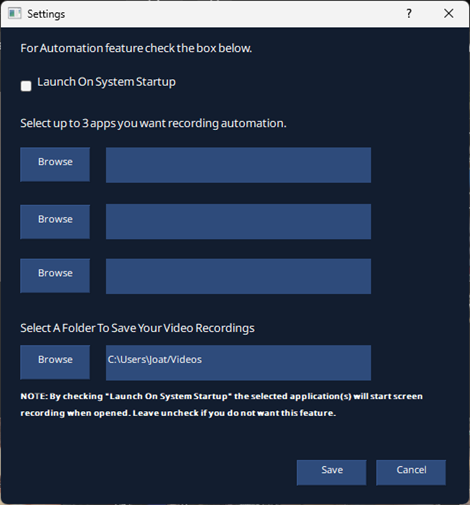

# Ẹro
Ẹro (translate to “Eye”, in the Urhobo language) is a cross-platform screen recording application with automation capabilities and a modern graphical interface. It leverages FFmpeg (via the python-ffmpeg library) to capture video and audio, and PyQt5 for its GUI. Ẹro runs on Windows and Linux, offering both manual recording controls and automated triggers. Users can configure Ẹro to start recording automatically when specified applications launch, making it ideal for creating tutorials or capturing workflows with minimal effort.

## Features
### Cross-Platform Screen Recording:
- Windows: Utilises FFmpeg’s GDIGAB device for screen capture and the dshow device for system audio capture.
- Linux: Utilises FFmpeg’s x11Grab for screen capture and PulseAudio (via pulse) for system audio.
- Threading: Recording runs in a separate thread to prevent the GUI from blocking during capture operations.

### Automation Feature:
- Application Triggers: Users can select up to three applications to trigger automatic recording upon launch.
- Process Monitoring: The psutil library (https://pypi.org/project/psutil/) monitors the status of selected applications by checking their process names or executable paths, initiating recording when a match is detected.
- System Notifications: The Plyer library (https://pypi.org/project/Plyer/) delivers cross-platform notifications to alert users when recording starts due to an application trigger.

### Graphical User Interface (GUI):
- Framework: Built with PyQt5 (https://pypi.org/project/PyQt5/), providing a modern and responsive interface.
- Live Preview: Uses the python-mss library (https://pypi.org/project/mss/) to display a real-time preview of the screen, helping users ensure the correct area is being recorded.
- A Settings window provides options to:
    - Enable or disable the automation feature.
    - Select applications to use as recording triggers.
    - Choose a directory where video recordings will be saved.

## Installation
1. Clone the repository from GitHub:
`git clone https://github.com/JoatXI/ero.git`

2. Install the required Python dependencies:
- Use pip3 on Linux to install the required Python packages:
`pip install -r requirements.txt`

## Usage
1. Navigate to the project directory and execute the main script
`python core/ero.py`

2. In the GUI, click the Start Recording button to begin manual screen capture.
3. Click Stop Recording to end the capture. The recorded video will be saved to the selected directory.
4. Use the Settings window to enable automation, choose trigger applications (up to 3), and set the output folder. When automation is enabled, Ẹro will start recording automatically whenever any of the selected applications launch.

